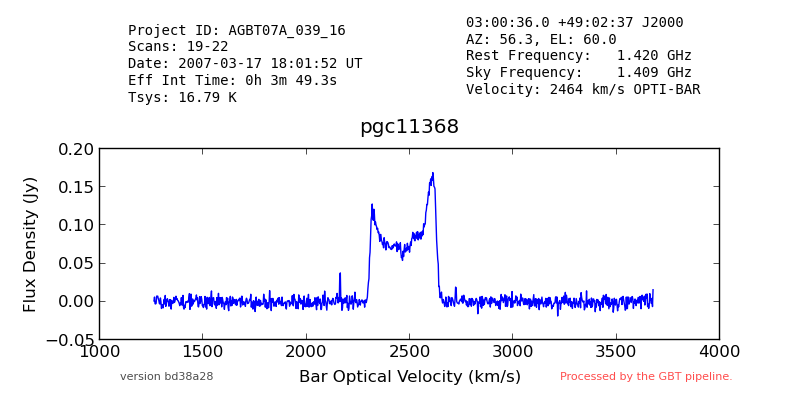

[Back to Joe's Notes](http://www.cv.nrao.edu/~jmasters)

# GBT Spectral Pipeline

* [Purpose](#purpose)
* [Uses](#uses)
* [Design](#design)
* [Implementation](#implementation)
* [Installation](#installation)
* [Running](#running)
* [Open issues](#tbd)
* [Other](#other)
* [References](#references)

## [Purpose](id:purpose)

### Problem

There is no quick and easy way to find out what has been observed by the GBT.  It is even harder to find "reduced" spectra.

### Solution

Create a "quick-look" pipeline to calibrate GBT spectral line pointing (i.e. not mapping) observations, produce a summary image and place it in a query-able archive.

## [Typical Uses](id:uses)

This pipeline is not meant to be run by outside users.  It's purpose is to populate archives that can be queried for pipeline data products.  We expect these archive queries will reflect questions like the following:

* Has source X been observed by the GBT?
	* What does the quick look calibrated spectrum look like?
	* When was it observed?
	* What was the system temperature?
* What sources were observed by user Y?
* What sources were part of project Z?

## [Design](id:design)

The goal of the GBT Spectral Pipeline is to generate a quick-look data reduction pipeline for GBT spectroscopy data that is capable of processing at least 80% of all sessions observed with the GBT in "Standard Observing Modes".

This is meant to provide the community with easy access to GBT data, including data from projects that they were not involved with.

### Black box view

At the highest level, the pipeline accepts and produces the following:

* **Inputs**:
	1. Uncalibrated "raw" SDFITS spectra
* **Outputs**:
	1. Calibrated, averaged, RFI-cleaned, baseline-fit "quick-look" SDFITS spectrum for each target in the input file
	1. Image showing the spectrum and "useful" metadata
	


### Summary

The quick-look pipeline operates with minimal user intervention.  The pipeline determines the observing mode used for spectroscopic data, calibrates and averages data for each target in the session, fits a spectral baseline, and writes the reduced data into an sdfits file.  Where appropriate, the pipeline attempts to identify and flag RFI.  In cases where complex baselines or extensive RFI are major issues, the observer will always do better to process the data by hand.

The pipeline generates a set of statistics and in some cases it will provide nominal scientific parameters (for example, fitting extragalactic HI profiles).  It generates a summary image with metadata about the spectrum for each target observed in the session.

The product of this pipeline (i.e. reduced spectra) is provided to the astronomical community through the query-able web interfaces.

### Constraints


## [Implementation](id:implementation)

The Spectral Pipeline is written mostly in GBTIDL[^1].  The first approach was to use Python but it quickly became apparent that a lot of the required functionality already existed in GBTIDL, so reusing that code was a better approach.

The IDL code does the calibration.  When a calibrated SDFITS file is produced, a python script generates a png plot of the spectrum and some metadata by extracting it from the FITS file.  The IDL code also produces a "data" file containing the velocity axis of the spectrum.  That is interpreted by the python code and used to create the plot with a velocity axis included. 

### Dependencies

The code requires GBTIDL and the following python libraries:

* numpy
* fitsio
* pylab


## [Installation Instructions](id:installation)

NB: GBTIDL is assumed to already be available.

Create a virtual environment for the python portion of the pipeline:

```
ssh pipeline@colossus
virtualenv /home/gbt7/pipeline/spectral-env
source /home/gbt7/pipeline/spectral-env/bin/activate
pip install fitsio
pip install matplotlib
pip install numpy
deactivate
```

If installing to the release area, run:

```
/users/pipeline/update-release-version.sh
```

If installing to the test area, run:

```
/users/pipeline/update-test-version.sh
```

If installing into a development area, cd to a directory where you want to install and check out the repository:

```
git clone https://github.com/jmasters/gbt-pipeline.git
```

## [How to run](id:running)

Make sure the spectral pipe directory is in the path seen by GBTIDL.  I do this by creating a symlink in my home directory called gbtidlpro.  For example:

```
ln -s /home/gbtpipeline/release/spectralpipe ~/gbtidlpro
```

Then, start gbtidl and run the pipeline:

```
gbtidl
GBTIDL -> spectralpipe, 'foo.fits'
```

This will produce a calibrated SDFITS spectrum and a png image for each target in the input file, in the current directory.

## [Open issues](id:tbd)

At the moment, the pipeline can process:

* extragalactic HI, and
* H2O maser observations

The goal is to support more types of observations.  It is also a goal to continually improve the calibration even though the products are intended to be "quick-look" only.


## [Other useful things to know about](id:other)

## [References](id:references)

[^1]: [http://gbtidl.nrao.edu](http://gbtidl.nrao.edu)


