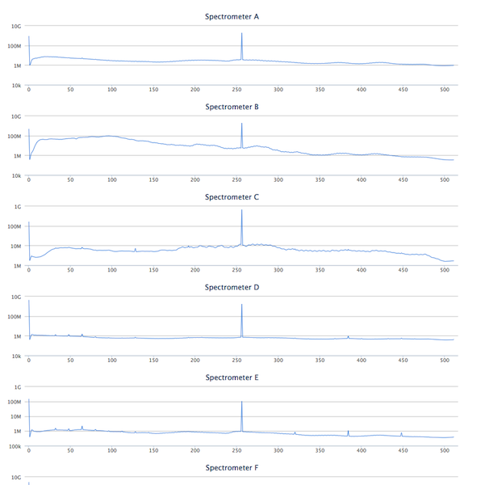

[Back to Joe's Notes](http://www.cv.nrao.edu/~jmasters)

# VEGAS Data Display

* [Purpose](#purpose)
* [Uses](#uses)
* [Design](#design)
* [Implementation](#implementation)
* [Installation](#installation)
* [Running](#running)
* [Open issues](#tbd)
* [Other](#other)
* [References](#references)

## [Purpose](id:purpose)

### Problem

Observers and operators do not have a way to quickly and easily view the data quality of their spectra during an observation.  Problems can manifest themselves in unpredictable ways, so it is useful to look at the data from different perspectives.  We already have the GBT FITS Monitor (GFM) Astrid spectral line plugin, but it's not well-suited for VEGAS.

### Solution

Create a real time spectral display.

The VEGAS Data Display project exists to:

1. fill the functionality gaps that exist in GFM regarding VEGAS data,
2. be a prototype client for a GB "streaming" system, and
3. be a prototype web-based observing tool.

## Where GFM falls short

* The spectral line mode is much too slow to display data for VEGAS. GFM waits until data is ready on disk.  This is not until the end of a scan and the delay can be significant.
* Given the number of display options provided by VEGAS, GFM's layout feels crowded.  There are also concerns about limited display colors and unhandled exceptions if the number of plots requested exceed internal limits.
* GFM does not provide a 3d view of the data that includes a time history over many spectral channels.  That is the purpose of a waterfall plot in the proposed display.[^1]

## [Typical Uses](id:uses)

Most users will likely view their data at a very high level to:

* check the frequency settings of their scans,
* look for problems across the band(s), and
* identify any time varying issues with the data.

## [Design](id:design)

### System
As previously stated, one of the reasons for this project was to use the newly developed "streaming" infrastructure for the GBT.  Members of the GB software group determined that this is best achieved using the ZeroMQ (ZMQ) library.  Another purpose was to be a prototype web app, with an eye toward possibly developing or migrating other observer tools as browser-based applications.  These project goals guided the design choices.

We use websockets so the server can push new data as it is observed to the client.

### Server
So, the high level design is that a "display server" connects to one or more Managers to read a ZMQ stream, averages the data to reduce the size and push it to the browser client through a websocket connection.  The client code allows some interactivity for data selection/filtering.  Those display options are communicated to the server, which responds with new data pushed to the client.  

### Client
The client display includes both a 2d waterfall plot and a series of 1d plots.  There is a spectrum plot below the waterfall plot and a time series plot to the side, both reflecting the current crosshair position on the waterfall plot for the row and column, respectively.





### Constraints

Moving large amounts of data to a client's browser is computationally prohibitive.  Without averaging, it is not possible to efficiently display many thousands of spectral channels of data on a screen with far fewer pixels.

Any change in the type of data displayed requires coordinated communication with a data server.

## [Implementation](id:implementation)

The display server is implemented in python using the Tornado framework, both because it is Python (a familiar language) and because it supports websockets.  The server reads ZMQ streams from GB M&C managers, reduces the volume of data and pushes it to a web client.

The web client is written in javascript, making use of the jQuery, jQueury-UI and highcharts libraries.  The client primarily for passive display, but also allows choices about what data is to be displayed.

### Dependencies

The display server depends on the M&C environment to provide streams from the VEGAS managers (one for each bank) and the LO/IF system to provide frequencies information via FITS files.  Those FITS files are assumed to be in the **/home/gbtdata/{project}/** directory where {project} is the project identifier for the current scan.

## [Installation Instructions](id:installation)

NB: These instructions should apply to any machine in GB, but have only been tested on "colossus".

* Get display source code

	```
DISPLAY_DIR=/home/sandboxes/${USER}/display
mkdir -p ${DISPLAY_DIR}
cd ${DISPLAY_DIR}
git clone https://github.com/jmasters/vegasrtdd-server
git clone https://github.com/jmasters/vegasrtdd-ui
```

* Install tornado

	```
source /home/gbt7/newt/McPython.bash
mkdir -p ~/.virtualenvs
virtualenv ~/.virtualenvs/display
source /users/jmasters/.virtualenvs/display/bin/activate
pip install tornado
```

* Install test environment (optional)

	Build the M&C repository following the instructions below.  NB: It's fine to skip the mkTelescopeDirs step.  That is only needed for installation.

	[https://safe.nrao.edu/wiki/bin/view/GB/Software/DevelopingMC](https://safe.nrao.edu/wiki/bin/view/GB/Software/DevelopingMC)

	* Build the protobufs

		```
cd ${DISPLAY_DIR}/vegasrtdd-server/
cp /home/sandboxes/${USER}/mc/ygor/libraries/DataPublisher/IDL/*.proto
cp /home/sandboxes/${USER}/mc/gbt/devices/backends/vegas/DataPublisher/IDL/*.proto
/home/gbt1/RH664/bin/protoc -I. -I/home/gbt1/RH664/include/ --python_out=. *.proto
```


## [Running the display](id:running)

### Live mode
* Run the display server (in a new terminal)

	```
DISPLAY_DIR=/home/sandboxes/${USER}/display
source /home/gbt/gbt.bash
source /home/gbt7/newt/McPython.bash
source /users/${USER}/.virtualenvs/vegasrtdd/bin/activate
cd ${DISPLAY_DIR}/vegasrtdd-server/
python display_server.py
```

* Launch a client

	Open a browser and go to [http://colossus.gb.nrao.edu:7777](http://colossus.gb.nrao.edu:7777)

### Development mode

Note that this assumes you have your own M&C build.  To build M&C, follow the instructions in the "Install test environment" section [above](#installation).

* Stream from a file (in a new terminal)

	```
source /home/sim/gbt.bash
cd /home/sandboxes/${USER}/mc/gbt/devices/backends/vegas/SimPublisher
./x86_64-linux/simVegasStreamer /lustre/gbtdata/TGBT13B_502_43/VEGAS A
```

* Display Server

	In a new terminal, open server_config.py and set

	```
LIVETEST = False
```

	Then, start a server

	```
DISPLAY_DIR=/home/sandboxes/${USER}/display
source /home/gbt/gbt.bash
source /home/gbt7/newt/McPython.bash
source /users/${USER}/.virtualenvs/display/bin/activate
cd ${DISPLAY_DIR}/vegasrtdd-server/```
```

* To launch a client:

	Open a browser and go to [http://colossus.gb.nrao.edu:7777](http://colossus.gb.nrao.edu:7777)

## [Open issues](id:tbd)

* encoding changed: need to fix using python array module.  see ray's email.
* only shows total power data
* assumes bank A is active
* does not blank "buttons" for inactive banks
* waterfall is limited to one bank at a time
* no "freeze" option
* no zooming or panning
* sluggish


## [Other useful things to know about](id:other)

* **list_all_services.py** will report what streams are running and their URLs
* **list_keys.py** will report the keys that are available for a stream
* The **CLEO vegas data monitor** is really useful to see the state and configuration of each of the banks
* **vegasdm** is another monitoring tool displaying different types of data

## [References](id:references)

[^1]: [http://www.gb.nrao.edu/vegas/report/realtimedisp.pdf](http://www.gb.nrao.edu/vegas/report/realtimedisp.pdf) (*NB: this is a proposal, not a formal specification*)  

